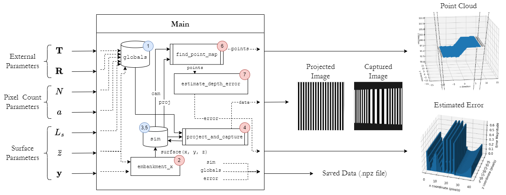
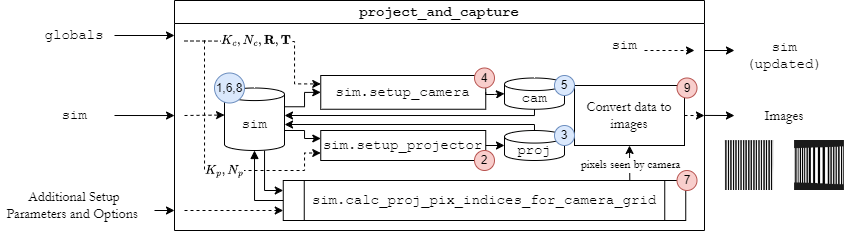
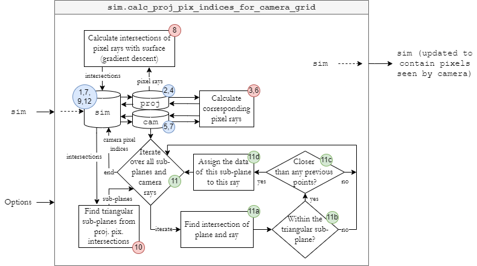
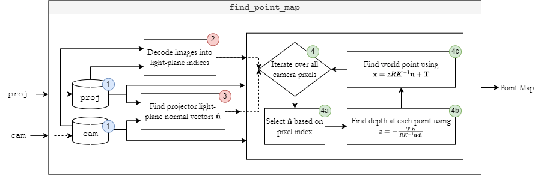

# Introduction

In order to simulate structured light scanning, the simulation
environment must be able to:

-   Simulate how an image distorts by virtually \"projecting\" an image
    onto a surface.

-   Be capable of projecting any image onto any surface or combination
    of surfaces.

-   Visually plot these projections, surfaces, and other useful guides
    to interpret the results.

-   Capture an image using a virtual \"camera\", and then, without using
    any knowledge about the surface itself, estimate a depth map of the
    surface in question.

-   Estimate the error of the depth map.

-   Be capable of using any requested projector/camera internal
    matrices, any camera position, and any number of projected and
    captured pixels (within what is tractable).

# Structure

## Surfaces

The first step toward creating the simulation environment was to create
a way to plot, visualise, and store surfaces. The chosen structure was
`(x, y, z) = surface(xin, yin, zin)`, where at least one of
`xin, yin, zin` are set to `None` and calculated by the `surface`
function. For example, for a plane with equation
$\bf x \cdot \hat{n} = d$, if given the point (x=2, y=2), where
$\mathbf{\hat{n}} = [1, 1, 1]^T, d=1$, then $4+z = 1$, i.e., $z = -3$.
The returned coordinates would then be (2, 2, -3).

These surfaces can be defined with some bounds, for example
$x \in [2, 4]$, $y \in [-1, 10]$, $z \in [-10, -1]$, and plotted within
these bounds. Lines and points can be represented in much the same way.
This gives the system the flexibility to work with any surface, provided
it is defined in the appropriate way.

## Projector

The next step to simulating structured light scanning was the projector.
In real life, a projector sends out a continuous projection of an image.
One can imagine this as a rectangular-based pyramid with the point at
the projector, and the base at the surface. Each pixel can be thought of
in the same way, forming a pyramid of small but non-zero width. Then,
any portion of a surface that intersects this pyramid is illuminated by
the information that pixel carries, i.e., by the colour of that pixel.
The bounds of this sub-surface are then defined by the lines where the
'walls' of the pyramid cross the surface. Since the simulation
environment accepts any kind of surface, no general assumption can be
made about these lines: they must be represented by parametric
equations.

These sub-surfaces are important because they define what the camera is
able to see. Whichever sub-surface a camera ray intersects is the
sub-surface the camera sees, i.e., this defines the colour of the
corresponding camera pixel.

However, representing every illuminated sub-surface with parametric
equations is inefficient. Not only would four parametric equations need
to be calculated and stored for every pixel, but subsequent
intersections with camera rays also become more complicated, both
mathematically and computationally. Moreover, in practice the number of
pixels being projected will be significant; changes in the surface
across a singular pixel will be small, and therefore, each pixel can be
approximated instead by a plane bounded by four lines (a sub-plane).

## Sub-Planes

Since the four corner points constrain the sub-plane, and they are not,
in general, guaranteed to be coplanar, the plane is overconstrained. To
find the coefficients of this sub-plane, the obvious solution would be
to calculate a least-squares fit for the parameters of the plane,
however, this misses a key defining characteristic of the illuminated
surface: no gaps should exist in the image from pixel to pixel. By using
the least-squares solution, in which the sub-planes are not constrained
to connect to one another, gaps may form in the illuminated surface.
These gaps could then allow virtual camera rays to slip through, thus
not recovering any information ('empty pixels').

The solution to this problem is simply to represent each pixel as two
triangular sub-planes, rather than as one rectangular one. The
triangular sub-planes are provided by the intersection of three of the
four corners of each pixel, and each has only one solution to the
parameters of the plane---so least-squares is not required. These planes
therefore must border one another such that no gaps should be possible.

## Camera

Recalling the pin-hole camera model, a camera (making a few simplifying
assumptions) is an array of light sensors (CCDs) that views the world
through a pin-hole. This means that all light entering the camera comes
converges to a single point, i.e., the camera centre. Each pixel simply
takes the average of all the light entering the corresponding CCD. Like
the projector, the light entering said CCD forms a rectangular pyramid
for each pixel, with its point at the camera centre, and base at the
surface. However, since some degree of discretisation is required in a
simulation environment, taking the average in this way would be
computationally expensive. For example, consider finding the
intersection of a 5x5 grid of 'sub-rays' and taking their average
compared to simply taking the value of the centre ray. The camera would
be more accurate to real life, however, in the end the improvements
would be minimal and for binary classification, would only confuse the
decoding process. Therefore, the virtual camera uses only a single ray
along the centre of the pixel 'pyramid', and where this ray first
intersects the illuminated surface, takes the colour of said surface,
saving it to the corresponding pixel in the captured image.

# Depth Recovery and Error Estimation

## Depth Recovery

Depth recovery was discussed at length in the work and so will not be described in detail
here. Since the simulation environment calculates the pixel rays for
both the camera and projector in order to calculate what the camera
sees, the vectors $\mathbf{\hat{n}}$ are already available and
translations, rotations, and camera matrices are known. $\mathbf{u}$ is
then simply the coordinate of the pixel in question, and all the
remaining terms are known, so depth $z$, and therefore world point
$\mathbf{x}$, can be recovered.

It is important to note that although these vectors are re-used between
calculations, this is purely for efficiency and does not affect the
depth map, since these vectors are simply calculated from the positions,
rotations, and internal parameter matrices of the projector and camera.
Besides these vectors, the only information that the depth mapping
procedure receives are the images projected by the projector and
captured by the camera. Thus, the depth recovery process therefore
operates in the same way that a real-world SLS system would.

## Error Estimation

For autonomous earth-moving, the ultimate aim is to create an accurate
and useful point cloud; estimated points should be as close to the
surface as possible. Therefore, a useful metric for error would be its
minimum distance from the surface. To calculate this, one would need to
find gradient vectors at the surface, perform potentially
computationally expensive searches, or make simplifying assumptions
which would likely reduce the flexibility of the code. Therefore, to
keep computations light, error is instead estimated by taking the
'correct' position of the world point as the output of the surface
function, with the estimated world point as the input: correct =
surface(estimated). The error is then simply the magnitude of the
difference between the estimated and 'correct' world points. This has
the obvious advantage of being quick and simple to implement, whilst
providing a good estimate of the error. However, one should be careful
when analysing error results using this metric.

# Flowcharts

As a further aid to understanding the functionality of the program, and
to help understand the results and discussion, a flowchart showing the
data transferred throughout the running of the code is provided below.

**Figure 1**: Flow diagram showing main information flow of the program.

Figure [1](#fg_flow_main) above shows the main loop of the program. The first step is to define
`globals`, which contains all the necessary global variables and forms
an input to certain functions. Next, the surface function is defined
based on supplied surface parameters, including $\bar{z}$. In the
Figure, the surface used is an embankment. The inputs $\mathbf{y}$ would
then include the height change and slope of the embankment. This surface
is then passed to `sim`, which is an object that contains and processes
most of the critical information for the running of the program,
including the objects `cam` and `proj`.

The next step is to run the procedure `projectandcapture`, which takes
as input both the `sim` and `globals` objects and computes the images
produced by the camera and the projector. This is the main intricacy of
the code, and so is broken down into further detail in Figures
[2](#fg_flow_project_and_capture) and
[3](#fg_flow_calc_proj_pix_indices) below.

The `sim` object is subsequently updated to hold the images and camera
and projector pixel rays (to minimise computational load), and the `cam`
and `proj` objects (containing the aforementioned images) form the input
to the subroutine `findpointmap` (also explained in more detail in
Figure [4](#fg_flow_find_point_map)).

Finally, the calculated point cloud is compared against the surface for
error, outputs are displayed for interpretation and data is saved in
case tests need to be re-analysed again later.

**Figure 2**: Flow diagram showing information flow for `projectandcapture`
subroutine.

Figure [2](#fg_flow_project_and_capture) above breaks down the
`projectandcapture` subroutine into smaller procedures. The subroutine
begins with `sim`, setting up the projector and the camera respectively.
These subroutines take the respective projector and camera parameters as
inputs from `globals`. The `proj`, `cam` and `sim` objects are then
updated before running `sim.calcprojpixindicesforcameragrid`, which
computes which projected pixel is intersected by each camera ray.
Finally, this data is converted to images and `sim` is updated.

**Figure 3**: Flow diagram showing information flow for
`sim.calcprojpixindicesforcameragrid`
subroutine.

The `sim.calcprojpixindicesforcameragrid` subroutine begins first by
calculating the pixel rays of the projector and camera and updating
their respective objects (as well as `sim`, which contains both `proj`
and `cam`) to hold this information. This information will be used to
calculate what is seen by the camera, but also will be re-used later to
calculate the point cloud.

The next major step calculates the intersections of pixel rays with the
surfaces held within `sim`. For each surface, a gradient descent
algorithm minimises the distance between the surface and a point on the
projector ray. Once the distance is within a threshold ($10^{-8}$), the
point on the ray can be considered as the intersection of the ray and
the surface[^1].

These intersections are then saved to `sim` and from these, a set of
triangular `simplane` objects (sub-planes) can are found. For each
camera ray, every sub-plane is considered. First, the intersection of
the (unconstrained) plane and the ray is found, then the loop checks if
the intersection is within the triangular sub-plane (the details of this
technique are provided in Appendix A). Once again, the lack of constraints on the
surface means that a ray could intersect a surface at multiple points.
Moreover, the simulation environment allows for multiple surfaces to be
considered at once. Since in the real world a camera cannot see through
surfaces, the natural choice is to choose the sub-plane that is closest
to the camera, which the camera would see first, thus blocking the view
of any surfaces which may be behind it. The subroutine therefore checks
if the distance from the camera centre to this sub-plane intersection is
lower than any previous distances found for this ray, and if so, updates
the data seen by said ray accordingly.

Finally, the simulation environment is updated to contain these "camera
pixel indices", i.e., the indices of the projected pixel that each
camera pixel sees.

**Figure 4**: Flow diagram showing information flow for
`findpointmap`.

Figure [4](#fg_flow_find_point_map){reference-type="ref"
reference="fg_flow_find_point_map"} shows the last critical subroutine,
`findpointmap`. This subroutine takes the `proj` and `cam` objects as
input---no other parts of `sim` are passed. These objects contain the
data that each projected/captured, and their respective pixel rays---but
no information about the surfaces or the intersections of the rays with
surfaces or sub-planes. As previously discussed, the rays are calculated
similarly: with no information of the virtual environment besides the
camera and projector parameters.

This subroutine then decodes the images stored in `proj` and `cam` into
indices---one for each projected light-plane. The normal vectors,
$\mathbf{\hat{n}}$ of each of these light planes are then found, and all
this information is used to calculate estimated depth and world points
using Equations 4 and
5. The subroutine finally outputs the point
map, i.e., an array of each of the world points, which forms an input to
the error estimation and visualisation procedures to give the outputs
shown in Figure [1](#fg_flow_main){reference-type="ref"
reference="fg_flow_main"}.

[^1]: If the threshold is not met then a warning is flagged, informing
    the user that the learning rate or tolerance should be adjusted. No
    adjustments had to be made for the data presented in this report.

# Typical Reconstructions

This section aims to present a typical result to help the reader gain a
more visual understanding of the workings of the program and the results
that can be expected.

## Reconstruction of a Plane

Figures [1](#fg_plane_example_proj_img) and
[2](#fg_plane_example_cam_img) show the projected and captured
images for a simple planar surface, with the projector pointed
"straight-on", and camera at a translation $\mathbf{T} = [50, 0, 0]^T$
(see Figure [3](#fg_plane_example_world)), and consequently rotated toward
the centre of the projected image (so that the entire image can be
seen). The resulting captured image slants away to one side, the same
way a square would experience parallax distortion when viewed at an
angle in 3D. This distortion is what we would expect, and is evidence
that the camera is working correctly.

  
**(a)**: Projected image.

  
**(b)**: Captured image.

**Figure 5**: Projected and captured images for a planar surface. Notice the only slight
variations in the camera image; distortion caused by a plane is minimal.

{#fg_plane_example_proj_img}

{#fg_plane_example_cam_img}

Note that the images shown in Figure
[\[fg_plane_example_imgs\]](#fg_plane_example_imgs){reference-type="ref"
reference="fg_plane_example_imgs"} are not enough on their own to
uniquely identify stripes of pixels; in fact, a total of six images are
projected and captured, and their combination is what allows for a
unique light plane index to be recovered (Figures
[\[fg_plane_example_all_proj_imgs\]](#fg_plane_example_all_proj_imgs){reference-type="ref"
reference="fg_plane_example_all_proj_imgs"},
[\[fg_plane_example_all_cam_imgs\]](#fg_plane_example_all_cam_imgs){reference-type="ref"
reference="fg_plane_example_all_cam_imgs"}).

These images are critical to allow the depth to be recovered, however,
since including each of the projected images does not, in general, aid
discussion, they will be omitted from any further results presented in
this report for the sake of brevity. The point cloud can be recovered using
these images and the known internal and external parameters of the
setup. This yields the point map shown in Figure
[4](#fg_plane_example_points){reference-type="ref"
reference="fg_plane_example_points"}.

{#fg_plane_example_world}

{#fg_plane_example_points}
